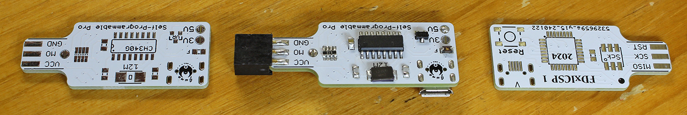
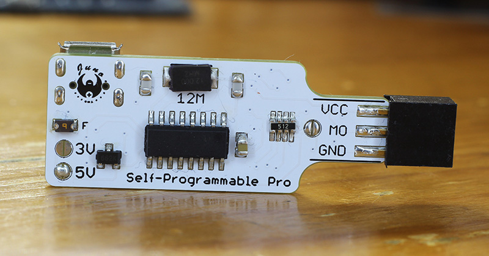
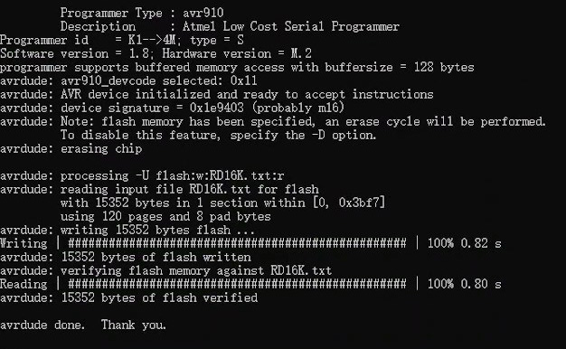
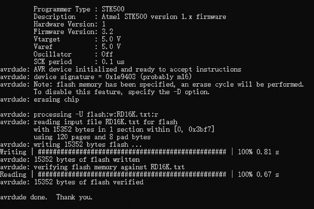
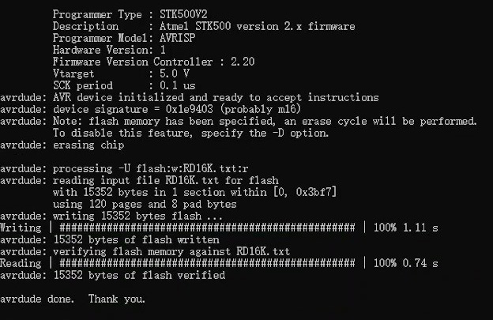

# FDxICSP - Self-Programmable High-Speed AVR SPI Programmer

FDxICSP is a 3-in-1 AVR SPI ISP programmer supporting  **AVR910**, **STK500v1**, and **STK500v2**.

<p align="center">
  
</p>

The Juno FDxICSP is a self-programmable programmer, a chicken, an egg, KFC, Chick-fil-A and more in one mini package, if you will. Correction: It is a chicken with 3 eggs. The self-programmable nature of the board allows it to switch seamlessly among 3 custom-written programmer firmware: AVR910, STK500v1, and STK500v2, on the same USB cable. All 3 of these firmware are optimized for speed, and they are probably the world's fastest SPI AVR MCU programmers.



The genuine CH340G USB-UART chip was chosen for the driver. This chip has been fully tested to be stable at a 2Mbps baud rate. For the Atmega88 MCU running on an RC oscillator clock of 8MHz, only 1Mbps is possible. Under various rigorous tests, this is not the bottleneck.

Hardware-wise, we have an elongated 6-pin ICSP female header for ease of connection to the target MCU board. The In-Circuit Serial Programming allows the MCUs to be programmable even on a board. A large RGB color LED shows every stage of the programmer's status. Pressing the reset button puts the device into bootloader mode for 1.5 seconds before loading the uploaded programmer program.
<br clear="left">

## Hardware
- 40 mm x 16 mm compact PCB
- ATmega88 programmer MCU with protected FDxboot bootloader
- CH340G USB-to-serial interface
- 1 Mbps programmer communication; 500 kbps FDxboot communication
- Automatic ISP SCK selection from 4 MHz down to 488 Hz
- Hardware SPI for faster targets and software SPI for very slow targets
- Selectable 5 V or 3 V target operation; connect only one voltage option
- Flash, EEPROM, signature, calibration, fuse, and lock-bit access
- Fuse and lock writes are guarded by a fresh target-signature check
- RGB status LED, reset button, over-current protection, and voltage protection

## Programmer Firmware

The same FDxICSP hardware can run any one of the three programmer firmwares below. FDxboot makes it possible to change firmware without another programmer.

| Programmer Firmware  | Write Record |  Read Record | Maximum-Speed Test |
|---|---:|---:|---|
| FDxICSP AVR910  | **28.3 kB/s** | **32.2 kB/s** | ATmega128, 256-byte pages, 4 MHz ISP SCK |
| FDxICSP STK500v1  | **25.59 kB/s** | **33.42 kB/s** | ATmega128, 129,998-byte test file |
| FDxICSP STK500v2  | **20.83 kB/s** | **31.17 kB/s** | ATmega128, 129,998-byte test file |

The AVR910 result is the original FDxICSP record and is probably a world-record result for an AVR910-compatible serial SPI programmer. The STK500v1 maximum was measured with V3.1 and the STK500v2 maximum with V2.10; the current V3.2 and V2.2 releases retain their programming hot paths while adding the shared LED behavior and fuse-write guard.

These are maximum measured results, not guaranteed speeds for every target. Actual performance depends on the target MCU, Flash page size, file size, target clock, selected ISP SCK, computer, USB connection, serial driver, AVRDUDE version, and verification overhead.

## FDxICSP 1.86 AVR910

<p>

The AVR910 firmware is the smallest and most specialized option. FDxICSP extends the old AVR910 protocol with signature-based target handling, automatic SCK selection, hardware and software SPI, page programming, EEPROM access, fuse and lock access, and optional manual SCK selection through the AVRDUDE devcode extension. The common ATmega16 screenshot test reached 18.72 kB/s write and 19.19 kB/s read. Its main limitation is device compatibility: AVR910 is an old protocol, and the current implementation is intended for classic SPI ISP AVR targets with no more than 128 KB Flash.
</p>

<br clear="left">

Use `-x devcode=0x11` for automatic SCK selection. Manual SCK override remains available for unusual or unstable targets.

## FDxICSP 3.2 STK500v1

<p>

The STK500v1 firmware is a practical general-purpose choice for classic AVR SPI ISP programming. AVRDUDE supplies the target parameters, so it generally supports a broader range of classic AVR devices than AVR910 without relying on the AVR910 device-code system. It supports Flash, EEPROM, signatures, calibration bytes, fuses, lock bits, automatic SCK selection, and the shared fuse-write guard. The common ATmega16 screenshot test reached 18.95 kB/s write and 22.91 kB/s read. The current FDxICSP implementation is limited to classic SPI ISP targets with no more than 128 KB Flash.
</p>

<br clear="left">

Use this firmware with AVRDUDE programmer type `stk500v1`.

## FDxICSP 2.2 STK500v2

<p>

The STK500v2 firmware provides the newest of the three supported AVRDUDE programmer protocols and broad compatibility with classic AVR device definitions. It supports Flash, EEPROM, signatures, calibration bytes, fuses, lock bits, automatic SCK selection, and guarded fuse or lock writes. The common ATmega16 screenshot test reached 13.83 kB/s write and 20.75 kB/s read. Although the full STK500v2 protocol can describe additional programming modes and larger address ranges, this compact FDxICSP implementation remains a classic SPI ISP programmer for targets with no more than 128 KB Flash.
</p>

<br clear="left">

Use this firmware with AVRDUDE programmer type `stk500v2`.

## MCU Support and Limitations

None of the three firmwares supports every AVR MCU. Current FDxICSP firmware is intended for classic 8-bit AVR devices that use the SPI ISP programming interface and have no more than 128 KB Flash.

The hardware does not support UPDI, PDI, TPI, JTAG, debugWIRE, high-voltage serial programming, or high-voltage parallel programming. It also cannot recover a target after the SPI programming interface or RESET pin has been disabled by fuse settings, because that recovery requires high-voltage programming hardware.

STK500v1 and STK500v2 generally provide broader classic-AVR compatibility because AVRDUDE sends the target parameters. AVR910 uses FDxICSP's compact signature decoder and remains the most specialized option.

## LED Status

- Idle: short purple followed by longer blue
- Writing Flash, EEPROM, fuse, or lock data: purple
- Reading and verification: cyan
- Chip erase: white
- Successful completion: two green flashes
- The blue channel also follows real ISP SCK activity

## Upload New Programmer Firmware

FDxboot uses the AVR109 programmer type at 500 kbps. Press RESET as the command starts so FDxboot remains active. The command format is the same for all three programmer firmwares; only the HEX filename changes.

```text
avrdude.exe -c avr109 -p m88 -b 500000 -P COM3 -U flash:w:"FDxICSP_2.2_STK500v2.hex":i -v
```

Available programmer firmware filenames:

- `FDxICSP_1.86_AVR910.hex`
- `FDxICSP_3.2_STK500v1.hex`
- `FDxICSP_2.2_STK500v2.hex`

## Using AVRDUDE

Replace `COM3`, `m16`, and the filename with the correct port, target part name, and file. The AVRDUDE programmer type must match the firmware currently installed on FDxICSP.

### Write Flash

```text
avrdude.exe -c avr910 -p m16 -b 1000000 -x devcode=0x11 -P COM3 -U flash:w:"firmware.hex":i
avrdude.exe -c stk500v1 -p m16 -b 1000000 -P COM3 -U flash:w:"firmware.hex":i
avrdude.exe -c stk500v2 -p m16 -b 1000000 -P COM3 -U flash:w:"firmware.hex":i
```

### Write EEPROM

```text
avrdude.exe -c stk500v1 -p m16 -b 1000000 -P COM3 -U eeprom:w:"eeprom.hex":i
```

### Read EEPROM

```text
avrdude.exe -c stk500v1 -p m16 -b 1000000 -P COM3 -U eeprom:r:"eeprom_backup.hex":i
```

## USB and Driver Notes

A stable USB cable, USB port, and CH340 driver are important at high serial baud rates. If AVRDUDE reports synchronization or transfer errors, try another cable or USB port before changing firmware. Some systems work better with an older CH341SER driver.

## Other Uses

Because FDxICSP is self-programmable, the board can also be used as a compact AVR development platform, custom serial-to-SPI tool, protocol experiment board, or base for another programmer design. Four MCU I/O pins and the three LED channels are available to custom firmware.

## Buy Me a Coffee

[](https://paypal.me/flyandance?country.x=US&locale.x=en_US)
